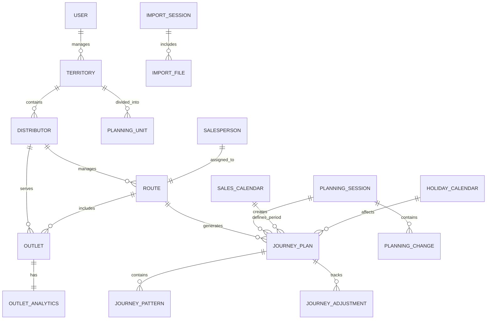
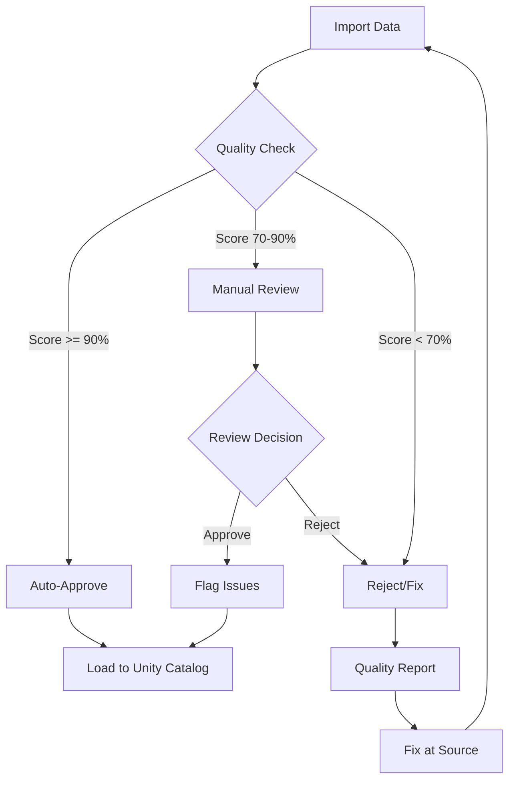
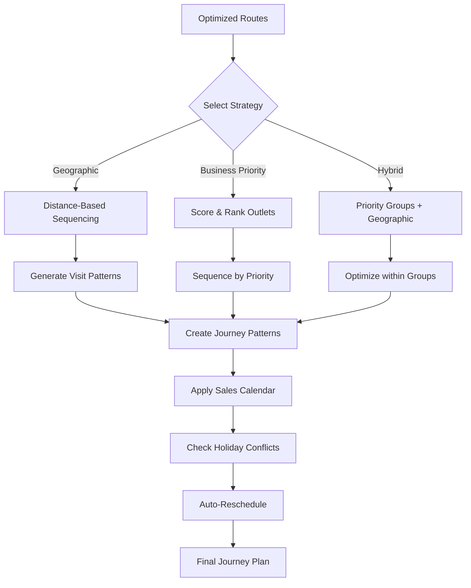
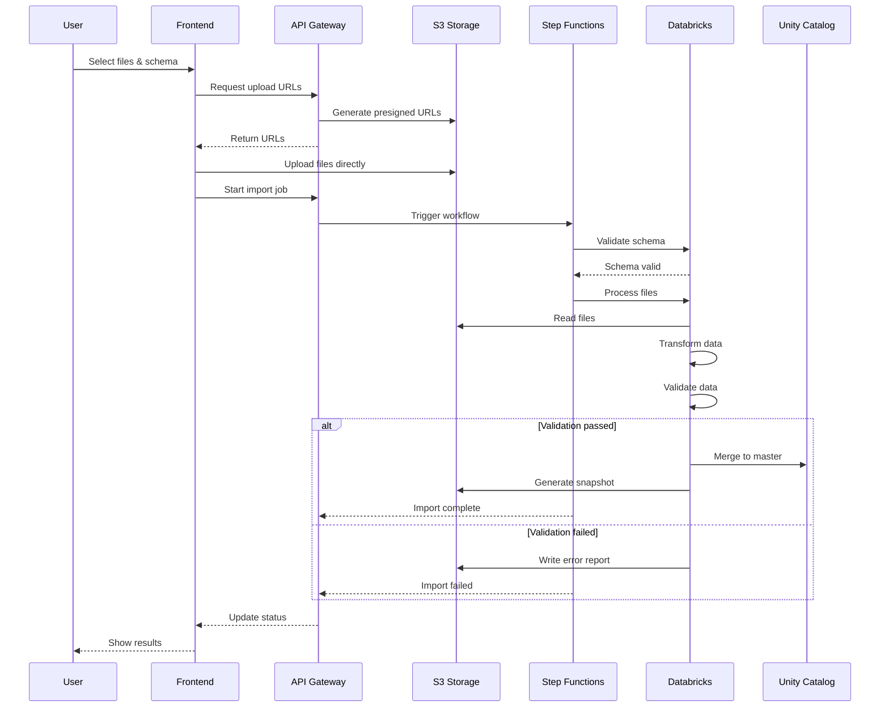

# Phase 2: Data Design & Flow Document

**Version**: 1.0  
**Last Updated**: December 2024  
**Status**: Draft for Review  
**Audience**: Data Engineers, Backend Developers, Data Analysts

## Table of Contents
1. [Executive Summary](#1-executive-summary)
2. [Data Model Overview](#2-data-model-overview)
3. [Master Data Entities](#3-master-data-entities)
4. [Import Data Formats](#4-import-data-formats)
5. [Data Validation Rules](#5-data-validation-rules)
6. [Data Quality Management](#6-data-quality-management)
7. [Data Transformation Pipeline](#7-data-transformation-pipeline)
8. [Territory Hierarchy Examples](#8-territory-hierarchy-examples)
9. [Import/Export Flows](#9-importexport-flows)
10. [Error Handling & Recovery](#10-error-handling--recovery)

---

## 1. Executive Summary

This document defines the complete data design for SRTO Phase 2, detailing data structures, validation rules, quality management procedures, and transformation pipelines. It complements the System Architecture document by providing detailed specifications for data handling throughout the system.

### Key Principles
- **Schema-First**: Define import schemas once, reuse for all imports
- **Quality Gates**: Multi-stage validation before data enters Unity Catalog
- **Denormalization for Performance**: Territory snapshots optimized for read
- **Audit Everything**: Complete data lineage and change tracking
- **Graceful Degradation**: System functions with incomplete data

### Data Scale
- 500K - 3M outlet records
- 500 - 10K distributor records
- 10K - 50K routes
- 100 - 500 territories
- 1M+ historical transactions per month

---

## 2. Data Model Overview

### Conceptual Data Model



### Data Storage Layers

| Layer | Purpose | Technology | Data Types |
|-------|---------|------------|------------|
| Hot | Active sessions, locks | DynamoDB | JSON documents |
| Warm | Territory snapshots | S3 + CloudFront | Compressed JSON |
| Cold | Master data, history | Unity Catalog | Delta tables |
| Archive | Old imports, audit logs | S3 Glacier | Parquet files |

---

## 3. Master Data Entities

### 3.1 Outlet Entity

```sql
-- Unity Catalog: srto_prod.master_data.outlets
CREATE TABLE outlets (
    -- Identity
    outlet_id STRING NOT NULL,
    outlet_code STRING,  -- External system ID
    outlet_name STRING NOT NULL,
    
    -- Location
    address STRING,
    address_line2 STRING,
    city STRING,
    state STRING,
    postal_code STRING,
    latitude DOUBLE,
    longitude DOUBLE,
    location_quality STRING,  -- 'EXACT', 'APPROXIMATE', 'MISSING'
    
    -- Classification
    channel STRING NOT NULL,  -- 'GT', 'MT', 'WS'
    sub_channel STRING,  -- 'KIRANA', 'SUPERMARKET', 'HYPERMARKET'
    tier STRING,  -- 'GOLD', 'SILVER', 'BRONZE'
    outlet_type STRING,  -- 'RETAIL', 'WHOLESALE', 'INSTITUTION'
    
    -- Sales Configuration
    sales_model STRING,  -- 'PRE_SALES', 'VAN_SALES', 'BOTH'
    fulfillment_type STRING,  -- 'DT', 'DSD', 'BOTH'
    merchandising_required BOOLEAN DEFAULT false,
    audit_frequency STRING,  -- 'WEEKLY', 'MONTHLY', 'QUARTERLY', 'NONE'
    
    -- Assignment
    territory_id STRING NOT NULL,
    dt_code STRING,
    route_id STRING,
    beat_sequence INT,
    
    -- Business Metrics
    monthly_potential DOUBLE,
    ytd_sales DOUBLE,
    credit_limit DOUBLE,
    payment_terms INT,  -- Days
    
    -- Analytics
    nppd_score DOUBLE,  -- Next Product Purchase Date score
    purchase_frequency STRING,  -- 'DAILY', 'WEEKLY', 'MONTHLY'
    avg_basket_size DOUBLE,
    last_order_date DATE,
    
    -- Metadata
    status STRING DEFAULT 'ACTIVE',  -- 'ACTIVE', 'INACTIVE', 'CLOSED'
    created_date TIMESTAMP DEFAULT CURRENT_TIMESTAMP,
    modified_date TIMESTAMP DEFAULT CURRENT_TIMESTAMP,
    created_by STRING,
    modified_by STRING,
    
    -- Data Quality
    validation_status STRING,  -- 'VALIDATED', 'WARNING', 'ERROR'
    validation_notes STRING,
    new_outlet_flag BOOLEAN DEFAULT false,
    
    PRIMARY KEY (outlet_id)
) 
USING DELTA
PARTITIONED BY (territory_id, channel)
TBLPROPERTIES (
    'delta.autoOptimize.optimizeWrite' = 'true',
    'delta.autoOptimize.autoCompact' = 'true',
    'delta.dataSkippingNumIndexedCols' = '8'
);
```

### 3.2 Distributor Entity

```sql
-- Unity Catalog: srto_prod.master_data.distributors
CREATE TABLE distributors (
    -- Identity
    dt_code STRING NOT NULL,
    dt_name STRING NOT NULL,
    legal_entity_name STRING,
    
    -- Location
    address STRING NOT NULL,
    city STRING,
    state STRING,
    postal_code STRING,
    latitude DOUBLE,
    longitude DOUBLE,
    
    -- Contact
    primary_contact STRING,
    phone STRING,
    alternate_phone STRING,
    email STRING,
    
    -- Configuration
    territory_id STRING NOT NULL,
    parent_dt_code STRING,  -- For sub-distributors
    dt_type STRING,  -- 'MASTER', 'SUB', 'SUPER_STOCKIST'
    
    -- Capacity
    num_salespeople INT,
    num_vehicles INT,
    warehouse_capacity DOUBLE,  -- In metric tons
    cold_storage_capacity DOUBLE,
    
    -- Business Terms
    credit_limit DOUBLE,
    payment_terms INT,
    commission_rate DOUBLE,
    
    -- Operational
    working_days STRING,  -- 'MON-SAT', 'MON-FRI', 'ALL'
    working_hours_start TIME,
    working_hours_end TIME,
    delivery_cutoff_time TIME,
    
    -- Metadata
    status STRING DEFAULT 'ACTIVE',
    onboarding_date DATE,
    contract_end_date DATE,
    created_date TIMESTAMP DEFAULT CURRENT_TIMESTAMP,
    modified_date TIMESTAMP DEFAULT CURRENT_TIMESTAMP,
    
    PRIMARY KEY (dt_code)
) 
USING DELTA
PARTITIONED BY (territory_id);
```

### 3.3 Route Entity

```sql
-- Unity Catalog: srto_prod.master_data.routes
CREATE TABLE routes (
    -- Identity
    route_id STRING NOT NULL,
    route_name STRING NOT NULL,
    route_code STRING,  -- External system code
    
    -- Assignment
    territory_id STRING NOT NULL,
    dt_code STRING,
    salesperson_id STRING,
    
    -- Configuration
    route_type STRING,  -- 'PRE_SALES', 'VAN_SALES', 'DELIVERY', 'MERCHANDISING'
    channel STRING,  -- 'GT', 'MT', 'MIXED'
    vehicle_type STRING,  -- 'MOTORCYCLE', 'CAR', 'VAN', 'TRUCK'
    
    -- Schedule
    frequency STRING,  -- 'DAILY', 'WEEKLY', 'BIWEEKLY', 'MONTHLY'
    visit_days STRING,  -- 'MON,WED,FRI' or 'ALL'
    week_schedule STRING,  -- 'ALL', 'ODD', 'EVEN', '1,3' (weeks of month)
    
    -- Metrics
    outlet_count INT,
    total_distance DOUBLE,  -- km
    estimated_time INT,  -- minutes
    avg_outlets_per_day INT,
    
    -- Optimization
    last_optimized_date DATE,
    optimization_score DOUBLE,
    manual_changes_count INT,
    
    -- Metadata
    status STRING DEFAULT 'ACTIVE',
    created_date TIMESTAMP DEFAULT CURRENT_TIMESTAMP,
    modified_date TIMESTAMP DEFAULT CURRENT_TIMESTAMP,
    
    PRIMARY KEY (route_id)
) 
USING DELTA
PARTITIONED BY (territory_id);
```

### 3.4 Territory Hierarchy

```sql
-- Unity Catalog: srto_prod.master_data.territory_hierarchy
CREATE TABLE territory_hierarchy (
    -- Identity
    territory_id STRING NOT NULL,
    territory_code STRING NOT NULL,
    territory_name STRING NOT NULL,
    
    -- Hierarchy
    level STRING NOT NULL,  -- 'COUNTRY', 'ZONE', 'REGION', 'AREA', 'TERRITORY'
    parent_territory_id STRING,
    hierarchy_path STRING,  -- '/IN/NORTH/DEL/CENTRAL'
    
    -- Geographic
    boundary_type STRING,  -- 'ADMINISTRATIVE', 'CUSTOM', 'POSTAL'
    boundary_definition STRING,  -- GeoJSON or postal codes
    center_latitude DOUBLE,
    center_longitude DOUBLE,
    area_sq_km DOUBLE,
    
    -- Planning Configuration
    is_planning_unit BOOLEAN DEFAULT false,
    planning_unit_id STRING,
    max_outlets_per_route INT,
    max_routes_per_dt INT,
    
    -- Metrics
    outlet_count INT,
    dt_count INT,
    route_count INT,
    population INT,
    market_potential DOUBLE,
    
    -- Metadata
    status STRING DEFAULT 'ACTIVE',
    created_date TIMESTAMP DEFAULT CURRENT_TIMESTAMP,
    modified_date TIMESTAMP DEFAULT CURRENT_TIMESTAMP,
    
    PRIMARY KEY (territory_id)
) 
USING DELTA;
```

### 3.5 Salesperson Entity

```sql
-- Unity Catalog: srto_prod.master_data.salespeople
CREATE TABLE salespeople (
    -- Identity
    salesperson_id STRING NOT NULL,
    employee_code STRING,
    name STRING NOT NULL,
    
    -- Contact
    phone STRING NOT NULL,
    alternate_phone STRING,
    email STRING,
    
    -- Assignment
    dt_code STRING,
    territory_id STRING,
    reporting_manager_id STRING,
    
    -- Work Configuration
    role STRING,  -- 'PRE_SALES', 'VAN_SALES', 'MERCHANDISER'
    employment_type STRING,  -- 'COMPANY', 'DISTRIBUTOR', 'CONTRACT'
    
    -- Schedule
    working_days STRING,  -- 'MON-SAT'
    work_start_time TIME DEFAULT '08:00:00',
    work_end_time TIME DEFAULT '18:00:00',
    break_duration INT DEFAULT 30,  -- minutes
    
    -- Location
    home_latitude DOUBLE,
    home_longitude DOUBLE,
    start_location STRING DEFAULT 'DT',  -- 'HOME', 'DT'
    end_location STRING DEFAULT 'DT',  -- 'HOME', 'DT'
    
    -- Capacity
    max_outlets_per_day INT DEFAULT 120,
    max_travel_time INT DEFAULT 480,  -- minutes
    vehicle_type STRING,
    
    -- Performance
    avg_outlets_visited INT,
    avg_productive_time INT,
    attendance_percentage DOUBLE,
    
    -- Metadata
    status STRING DEFAULT 'ACTIVE',
    joining_date DATE,
    created_date TIMESTAMP DEFAULT CURRENT_TIMESTAMP,
    modified_date TIMESTAMP DEFAULT CURRENT_TIMESTAMP,
    
    PRIMARY KEY (salesperson_id)
) 
USING DELTA;
```

### 3.6 Sales Calendar

```sql
-- Unity Catalog: srto_prod.master_data.sales_calendar
CREATE TABLE sales_calendar (
    -- Identity
    calendar_id STRING NOT NULL,
    company_id STRING NOT NULL,  -- For multi-company support
    
    -- Calendar structure
    calendar_type STRING NOT NULL,  -- '4-4-5', '4-5-4', '5-4-4', 'STANDARD'
    fiscal_year_start_month INT,  -- 1-12
    
    -- Period definition
    sales_year INT NOT NULL,
    sales_period INT NOT NULL,  -- 1-12 or 1-13 depending on type
    sales_week INT NOT NULL,    -- Week within period
    sales_day INT NOT NULL,     -- 1-7 within week
    
    -- Date mapping
    calendar_date DATE NOT NULL,
    gregorian_year INT,
    gregorian_month INT,
    gregorian_week INT,
    day_of_week STRING,  -- 'MON', 'TUE', etc.
    
    -- Period metadata
    period_name STRING,  -- 'P1', 'January', 'P01-JAN'
    period_start_date DATE,
    period_end_date DATE,
    period_working_days INT,
    
    -- Flags
    is_working_day BOOLEAN DEFAULT true,
    is_period_start BOOLEAN,
    is_period_end BOOLEAN,
    is_year_start BOOLEAN,
    is_year_end BOOLEAN,
    
    PRIMARY KEY (calendar_id, calendar_date),
    UNIQUE KEY (company_id, sales_year, sales_period, sales_week, sales_day)
) 
USING DELTA
PARTITIONED BY (company_id, sales_year);
```

### 3.7 Holiday Calendar

```sql
-- Unity Catalog: srto_prod.master_data.holiday_calendar
CREATE TABLE holiday_calendar (
    -- Identity
    holiday_id STRING NOT NULL,
    company_id STRING,
    
    -- Holiday details
    holiday_date DATE NOT NULL,
    holiday_name STRING NOT NULL,
    holiday_type STRING NOT NULL,  -- 'COMPANY', 'NATIONAL', 'REGIONAL', 'RELIGIOUS', 'LOCAL'
    
    -- Applicability
    applicable_level STRING,  -- 'ALL', 'TERRITORY', 'DT'
    applicable_territories ARRAY<STRING>,  -- List of territory IDs
    applicable_dts ARRAY<STRING>,  -- List of DT codes
    
    -- Impact
    impact_type STRING NOT NULL,  -- 'NO_OPERATIONS', 'NO_SALES', 'NO_DELIVERY', 'REDUCED_HOURS'
    alternate_working_hours STRING,  -- If REDUCED_HOURS
    
    -- Recurrence
    is_recurring BOOLEAN DEFAULT false,
    recurrence_rule STRING,  -- 'YEARLY', 'LUNAR', 'CUSTOM'
    recurrence_pattern STRING,  -- JSON with pattern details
    
    -- Auto-reschedule rules
    reschedule_visits BOOLEAN DEFAULT true,
    reschedule_to STRING,  -- 'NEXT_DAY', 'PREVIOUS_DAY', 'SAME_WEEK'
    
    -- Metadata
    created_date TIMESTAMP DEFAULT CURRENT_TIMESTAMP,
    created_by STRING,
    
    PRIMARY KEY (holiday_id),
    KEY idx_date (holiday_date),
    KEY idx_territory (applicable_territories)
) 
USING DELTA
PARTITIONED BY (YEAR(holiday_date));
```

### 3.8 Event Calendar

```sql
-- Unity Catalog: srto_prod.master_data.event_calendar
CREATE TABLE event_calendar (
    -- Identity
    event_id STRING NOT NULL,
    
    -- Event details
    event_date DATE NOT NULL,
    event_end_date DATE,  -- For multi-day events
    event_name STRING NOT NULL,
    event_type STRING NOT NULL,  -- 'FESTIVAL', 'MARKET_DAY', 'MELA', 'SEASON', 'PROMOTION'
    
    -- Location
    territory_id STRING NOT NULL,
    specific_locations ARRAY<STRING>,  -- Cities, areas affected
    
    -- Business impact
    impact_on_sales STRING,  -- 'HIGH_POSITIVE', 'POSITIVE', 'NEUTRAL', 'NEGATIVE'
    expected_footfall_increase DOUBLE,  -- Percentage
    recommended_stock_increase DOUBLE,  -- Percentage
    
    -- Planning recommendations
    increase_visit_frequency BOOLEAN DEFAULT false,
    priority_products ARRAY<STRING>,  -- Product categories to focus
    special_instructions STRING,
    
    -- Historical performance
    previous_year_sales_lift DOUBLE,
    previous_year_notes STRING,
    
    PRIMARY KEY (event_id),
    KEY idx_territory_date (territory_id, event_date)
) 
USING DELTA
PARTITIONED BY (territory_id, YEAR(event_date));
```

### 3.9 Journey Plan Master

```sql
-- Unity Catalog: srto_prod.master_data.journey_plans
CREATE TABLE journey_plans (
    -- Identity
    journey_plan_id STRING NOT NULL,
    territory_id STRING NOT NULL,
    channel STRING,  -- 'GT', 'MT', 'MIXED'
    
    -- Planning period
    calendar_type STRING NOT NULL DEFAULT 'SALES',  -- 'SALES', 'GREGORIAN'
    plan_year INT NOT NULL,
    plan_period INT NOT NULL,  -- Month or Period number
    plan_start_date DATE NOT NULL,
    plan_end_date DATE NOT NULL,
    
    -- Planning configuration
    planning_session_id STRING NOT NULL,
    optimization_strategy STRING,  -- 'GEOGRAPHIC', 'BUSINESS_PRIORITY', 'HYBRID'
    priority_weights STRING,  -- JSON with weight configuration
    
    -- Sequencing parameters (if business priority used)
    tier_weight DOUBLE DEFAULT 0.3,
    stock_risk_weight DOUBLE DEFAULT 0.3,
    order_value_weight DOUBLE DEFAULT 0.4,
    
    -- Version control
    version INT NOT NULL DEFAULT 1,
    is_current BOOLEAN DEFAULT true,
    parent_version_id STRING,  -- Previous version
    version_notes STRING,
    
    -- Status workflow
    status STRING NOT NULL,  -- 'DRAFT', 'OPTIMIZED', 'REVIEWED', 'APPROVED', 'PUBLISHED', 'ACTIVE', 'COMPLETED'
    
    -- Metrics
    total_outlets INT,
    total_visits_planned INT,
    total_routes INT,
    coverage_percentage DOUBLE,
    
    -- Approval workflow
    created_date TIMESTAMP DEFAULT CURRENT_TIMESTAMP,
    created_by STRING NOT NULL,
    reviewed_date TIMESTAMP,
    reviewed_by STRING,
    approved_date TIMESTAMP,
    approved_by STRING,
    published_date TIMESTAMP,
    published_by STRING,
    
    PRIMARY KEY (journey_plan_id),
    KEY idx_current (territory_id, plan_year, plan_period, is_current)
) 
USING DELTA
PARTITIONED BY (territory_id, plan_year);
```

### 3.10 Journey Patterns (Pattern-based Storage)

```sql
-- Unity Catalog: srto_prod.master_data.journey_patterns
CREATE TABLE journey_patterns (
    -- Identity
    pattern_id STRING NOT NULL,
    journey_plan_id STRING NOT NULL,
    
    -- Assignment
    route_id STRING NOT NULL,
    salesperson_id STRING NOT NULL,
    outlet_id STRING NOT NULL,
    
    -- Visit pattern (using sales calendar)
    visit_frequency STRING NOT NULL,  -- 'WEEKLY', 'BIWEEKLY', 'MONTHLY'
    
    -- Week patterns within period
    week1_days ARRAY<STRING>,  -- ['MON', 'THU']
    week2_days ARRAY<STRING>,  -- ['TUE']
    week3_days ARRAY<STRING>,  -- ['MON', 'THU']
    week4_days ARRAY<STRING>,  -- ['FRI']
    week5_days ARRAY<STRING>,  -- NULL for 4-week periods
    
    -- Alternative: Encoded pattern
    pattern_code STRING,  -- 'W1:MON,THU|W3:MON,THU' for biweekly
    
    -- Sequencing hints
    visit_priority INT,  -- For business priority sequencing
    preferred_time_slot STRING,  -- 'MORNING', 'AFTERNOON', 'EVENING'
    avg_sequence_position INT,  -- Typical position in daily route
    
    -- Business metrics for prioritization
    outlet_tier STRING,
    avg_order_value DOUBLE,
    stock_out_risk_score DOUBLE,
    days_since_last_visit INT,
    
    -- Constraints
    fixed_appointment BOOLEAN DEFAULT false,
    appointment_time TIME,
    appointment_duration INT,  -- minutes
    
    -- Special handling
    requires_pre_call BOOLEAN DEFAULT false,
    requires_merchandise_check BOOLEAN DEFAULT false,
    special_instructions STRING,
    
    PRIMARY KEY (pattern_id),
    KEY idx_journey_route (journey_plan_id, route_id),
    KEY idx_outlet (outlet_id)
) 
USING DELTA
PARTITIONED BY (journey_plan_id);
```

### 3.11 Journey Adjustments (Audit Trail)

```sql
-- Unity Catalog: srto_prod.master_data.journey_adjustments
CREATE TABLE journey_adjustments (
    -- Identity
    adjustment_id STRING NOT NULL,
    journey_plan_id STRING NOT NULL,
    
    -- When
    adjustment_timestamp TIMESTAMP DEFAULT CURRENT_TIMESTAMP,
    effective_date DATE,  -- When the change applies
    
    -- Who
    adjusted_by STRING NOT NULL,
    user_role STRING,  -- 'PLANNER', 'DT_USER', 'SYSTEM'
    
    -- What changed
    adjustment_type STRING NOT NULL,  -- 'ADD_OUTLET', 'REMOVE_OUTLET', 'CHANGE_PATTERN', 'CHANGE_SEQUENCE', 'CHANGE_ROUTE'
    
    -- Affected entities
    outlet_id STRING,
    route_id STRING,
    old_route_id STRING,
    new_route_id STRING,
    
    -- Pattern changes
    old_pattern STRING,  -- Previous visit pattern
    new_pattern STRING,  -- New visit pattern
    old_week_days STRING,
    new_week_days STRING,
    
    -- Sequence changes
    old_priority INT,
    new_priority INT,
    
    -- Reason
    reason_code STRING,  -- 'CUSTOMER_REQUEST', 'OPTIMIZATION', 'HOLIDAY_CONFLICT', 'CAPACITY'
    reason_details STRING,
    
    -- Impact
    affects_visits_count INT,
    affects_dates ARRAY<DATE>,
    
    PRIMARY KEY (adjustment_id),
    KEY idx_journey (journey_plan_id),
    KEY idx_outlet (outlet_id),
    KEY idx_timestamp (adjustment_timestamp)
) 
USING DELTA
PARTITIONED BY (journey_plan_id, DATE(adjustment_timestamp));
```

---

## 4. Import Data Formats

### 4.1 Supported File Formats

| Format | Extension | Max Size | Use Case |
|--------|-----------|----------|----------|
| CSV | .csv | 500 MB | Standard imports |
| Excel | .xlsx, .xls | 200 MB | Multi-sheet data |
| JSON | .json | 100 MB | API imports |
| Parquet | .parquet | 1 GB | Large datasets |

### 4.2 Standard Import Templates

#### Outlet Master (Denormalized)
```csv
outlet_id,outlet_code,outlet_name,address,city,state,postal_code,latitude,longitude,channel,sub_channel,tier,sales_model,territory_code,dt_code,route_code,beat_sequence,monthly_potential,credit_limit,status
OTL001,EXT001,Krishna Store,"15 MG Road",Delhi,Delhi,110001,28.6139,77.2090,GT,KIRANA,SILVER,PRE_SALES,AREA-DEL-01,DT-001,R-101,5,45000,30000,ACTIVE
OTL002,EXT002,Big Bazaar Janakpuri,"District Centre",Delhi,Delhi,110058,28.6219,77.0878,MT,HYPERMARKET,GOLD,PRE_SALES,AREA-DEL-01,MULTIPLE,MT-005,,500000,0,ACTIVE
```

#### Outlet Master (Normalized)
**outlets.csv**:
```csv
outlet_id,outlet_code,outlet_name,address,city,state,postal_code,latitude,longitude,channel,sub_channel,tier,sales_model,monthly_potential,credit_limit,status
OTL001,EXT001,Krishna Store,"15 MG Road",Delhi,Delhi,110001,28.6139,77.2090,GT,KIRANA,SILVER,PRE_SALES,45000,30000,ACTIVE
```

**outlet_territory_mapping.csv**:
```csv
outlet_id,territory_code,effective_date,end_date
OTL001,AREA-DEL-01,2024-01-01,
```

**outlet_dt_mapping.csv**:
```csv
outlet_id,dt_code,effective_date,end_date
OTL001,DT-001,2024-01-01,
OTL002,DT-001,2024-01-01,2024-01-15
OTL002,DT-002,2024-01-16,
```

**outlet_route_mapping.csv**:
```csv
outlet_id,route_code,beat_sequence,visit_frequency,visit_days,week_schedule
OTL001,R-101,5,WEEKLY,MON,ALL
OTL002,MT-005,,BIWEEKLY,"TUE,THU",ODD
```

#### Territory Hierarchy
```csv
territory_id,territory_code,territory_name,level,parent_territory_id,is_planning_unit
TER001,IN,India,COUNTRY,,FALSE
TER002,IN-NORTH,North Zone,ZONE,TER001,FALSE
TER003,IN-NORTH-DEL,Delhi Region,REGION,TER002,FALSE
TER004,IN-NORTH-DEL-CENTRAL,Central Delhi,AREA,TER003,TRUE
```

### 4.3 JSON Import Format

```json
{
  "import_metadata": {
    "source_system": "SAP",
    "export_date": "2024-01-15T10:30:00Z",
    "record_count": 1500,
    "schema_version": "2.0"
  },
  "outlets": [
    {
      "outlet_id": "OTL001",
      "outlet_code": "EXT001",
      "outlet_name": "Krishna Store",
      "location": {
        "address": "15 MG Road",
        "city": "Delhi",
        "state": "Delhi",
        "postal_code": "110001",
        "coordinates": {
          "latitude": 28.6139,
          "longitude": 77.2090
        }
      },
      "classification": {
        "channel": "GT",
        "sub_channel": "KIRANA",
        "tier": "SILVER"
      },
      "assignment": {
        "territory_code": "AREA-DEL-01",
        "dt_code": "DT-001",
        "route_code": "R-101"
      }
    }
  ]
}
```

### 4.4 Calendar Configuration Formats

#### Sales Calendar Import
```csv
calendar_id,company_id,calendar_type,sales_year,sales_period,sales_week,sales_day,calendar_date,period_name,is_working_day
CAL001,COMP001,4-4-5,2024,1,1,1,2024-04-01,April,TRUE
CAL001,COMP001,4-4-5,2024,1,1,2,2024-04-02,April,TRUE
CAL001,COMP001,4-4-5,2024,1,1,3,2024-04-03,April,TRUE
```

#### Holiday Calendar Import
```csv
holiday_id,company_id,holiday_date,holiday_name,holiday_type,applicable_level,applicable_territories,impact_type,reschedule_visits,reschedule_to
HOL001,COMP001,2024-01-26,Republic Day,NATIONAL,ALL,,NO_OPERATIONS,TRUE,NEXT_DAY
HOL002,COMP001,2024-03-25,Holi,RELIGIOUS,TERRITORY,"NORTH,WEST",NO_SALES,TRUE,NEXT_DAY
HOL003,,2024-04-14,Tamil New Year,REGIONAL,TERRITORY,TN,NO_OPERATIONS,TRUE,PREVIOUS_DAY
```

#### Event Calendar Import
```csv
event_id,event_date,event_end_date,event_name,event_type,territory_id,impact_on_sales,expected_footfall_increase,increase_visit_frequency,special_instructions
EVT001,2024-10-20,2024-10-25,Diwali,FESTIVAL,AREA-DEL-01,HIGH_POSITIVE,150,TRUE,Stock 2x sweets and snacks
EVT002,2024-01-14,,Makar Sankranti,FESTIVAL,AREA-GUJ-01,POSITIVE,50,FALSE,Focus on traditional items
EVT003,2024-06-01,2024-08-31,Monsoon Season,SEASON,REGION-MUM,NEGATIVE,-20,FALSE,Reduce perishables
```

#### Journey Pattern Import (for corrections/manual plans)
```csv
pattern_id,journey_plan_id,route_id,outlet_id,visit_frequency,week1_days,week2_days,week3_days,week4_days,week5_days,visit_priority
PAT001,JP-2024-01,R-101,OTL001,WEEKLY,"MON,THU","MON,THU","MON,THU","MON,THU",MON,1
PAT002,JP-2024-01,R-101,OTL002,BIWEEKLY,MON,,MON,,,2
PAT003,JP-2024-01,R-101,OTL003,MONTHLY,,TUE,,,3
```

---

## 5. Data Validation Rules

### 5.1 Validation Rule Categories

| Category | Severity | Action | Examples |
|----------|----------|--------|----------|
| Schema | ERROR | Reject file | Missing required columns |
| Format | ERROR | Reject record | Invalid date format |
| Business | WARNING | Flag record | Outlet outside territory |
| Quality | INFO | Log issue | Missing optional field |

### 5.2 Field-Level Validation Rules

#### Outlet Validations
```yaml
outlet_validations:
  outlet_id:
    - rule: NOT_NULL
      severity: ERROR
      message: "Outlet ID is required"
    - rule: UNIQUE
      severity: ERROR
      message: "Duplicate outlet ID: {value}"
    - rule: PATTERN
      pattern: "^[A-Z0-9]{3,20}$"
      severity: WARNING
      message: "Outlet ID should be 3-20 alphanumeric characters"

  outlet_name:
    - rule: NOT_NULL
      severity: ERROR
    - rule: LENGTH
      min: 3
      max: 100
      severity: ERROR
    - rule: NO_SPECIAL_CHARS
      allowed: "- & ."
      severity: WARNING

  latitude:
    - rule: RANGE
      min: -90
      max: 90
      severity: ERROR
    - rule: PRECISION
      decimal_places: 6
      severity: INFO
    - rule: PAIRED_WITH
      field: longitude
      severity: ERROR
      message: "Latitude requires longitude"

  channel:
    - rule: ENUM
      values: ["GT", "MT", "WS"]
      severity: ERROR
    - rule: CONSISTENT_WITH_SUBCHANNEL
      severity: WARNING
      mapping:
        GT: ["KIRANA", "GROCERY", "PAAN_SHOP"]
        MT: ["SUPERMARKET", "HYPERMARKET", "CONVENIENCE"]

  tier:
    - rule: ENUM
      values: ["GOLD", "SILVER", "BRONZE", null]
      severity: WARNING
    - rule: REQUIRED_FOR_CHANNEL
      channels: ["GT", "MT"]
      severity: WARNING

  dt_code:
    - rule: FOREIGN_KEY
      reference: distributors.dt_code
      severity: ERROR
      message: "DT code {value} not found"
    - rule: MULTIPLE_VALUE
      value: "MULTIPLE"
      allowed_channels: ["MT"]
      severity: ERROR
      message: "MULTIPLE only allowed for MT channel"
```

#### Geographic Validations
```yaml
geographic_validations:
  coordinate_pair:
    - rule: BOTH_OR_NONE
      fields: [latitude, longitude]
      severity: ERROR
    - rule: WITHIN_COUNTRY
      country: "IN"
      bounds:
        north: 37.0
        south: 8.0
        east: 97.0
        west: 68.0
      severity: WARNING
      message: "Coordinates outside India"

  address_quality:
    - rule: GEOCODING_MATCH
      threshold: 0.8
      severity: WARNING
      message: "Address doesn't match coordinates"
    - rule: COMPLETENESS
      required_with_no_coords: [address, city, state]
      severity: ERROR
```

#### Business Rule Validations
```yaml
business_validations:
  sales_model_consistency:
    - rule: CHANNEL_COMPATIBILITY
      mappings:
        PRE_SALES: ["GT", "MT", "WS"]
        VAN_SALES: ["GT", "WS"]
      severity: ERROR

  territory_assignment:
    - rule: VALID_HIERARCHY
      severity: ERROR
      message: "Outlet must be assigned to leaf territory"
    - rule: DT_IN_SAME_TERRITORY
      severity: ERROR
      message: "DT {dt_code} not in territory {territory_code}"

  route_capacity:
    - rule: MAX_OUTLETS_PER_ROUTE
      max: 150
      severity: WARNING
    - rule: VISIT_FREQUENCY_VALID
      allowed: ["DAILY", "WEEKLY", "BIWEEKLY", "MONTHLY"]
      severity: ERROR
```

### 5.3 Cross-Entity Validations

```python
def validate_cross_entity_rules(import_session_id: str):
    validations = []
    
    # Rule 1: All outlets must have valid DT assignment
    orphan_outlets = spark.sql(f"""
        SELECT o.outlet_id, o.dt_code
        FROM staging.outlets o
        LEFT JOIN staging.distributors d ON o.dt_code = d.dt_code
        WHERE o.dt_code IS NOT NULL 
        AND d.dt_code IS NULL
        AND o.channel = 'GT'
    """)
    
    if orphan_outlets.count() > 0:
        validations.append({
            "rule": "VALID_DT_ASSIGNMENT",
            "severity": "ERROR",
            "count": orphan_outlets.count(),
            "sample_records": orphan_outlets.limit(10).collect()
        })
    
    # Rule 2: Territory outlet count limits
    territory_counts = spark.sql(f"""
        SELECT 
            t.territory_id,
            t.territory_name,
            t.max_outlets,
            COUNT(o.outlet_id) as outlet_count
        FROM staging.outlets o
        JOIN staging.territories t ON o.territory_id = t.territory_id
        WHERE t.is_planning_unit = true
        GROUP BY t.territory_id, t.territory_name, t.max_outlets
        HAVING COUNT(o.outlet_id) > t.max_outlets
    """)
    
    # Rule 3: Route visit frequency consistency
    invalid_frequencies = spark.sql(f"""
        SELECT 
            r.route_id,
            o.outlet_id,
            o.tier,
            orm.visit_frequency
        FROM staging.outlet_route_mapping orm
        JOIN staging.outlets o ON orm.outlet_id = o.outlet_id
        JOIN staging.routes r ON orm.route_code = r.route_code
        WHERE 
            (o.tier = 'GOLD' AND orm.visit_frequency NOT IN ('DAILY', 'WEEKLY'))
            OR (o.tier = 'SILVER' AND orm.visit_frequency = 'MONTHLY')
    """)
    
    return validations
```

### 5.4 Journey Plan Validation Rules

#### Pattern Validations
```yaml
journey_pattern_validations:
  visit_frequency_consistency:
    - rule: FREQUENCY_MATCHES_PATTERN
      description: Pattern must match declared frequency
      severity: ERROR
      validation: |
        IF frequency = 'WEEKLY' THEN all weeks must have visits
        IF frequency = 'BIWEEKLY' THEN alternate weeks must have visits
        IF frequency = 'MONTHLY' THEN only one week should have visits
      
  day_validity:
    - rule: VALID_WEEK_DAYS
      allowed: ["MON", "TUE", "WED", "THU", "FRI", "SAT", "SUN"]
      severity: ERROR
      
    - rule: WORKING_DAYS_ONLY
      description: Visits only on working days per sales calendar
      severity: WARNING
      
  pattern_completeness:
    - rule: NO_EMPTY_PATTERNS
      description: At least one visit day must be specified
      severity: ERROR
      
    - rule: REASONABLE_FREQUENCY
      description: No outlet visited more than once per day
      severity: ERROR

journey_plan_validations:
  coverage_rules:
    - rule: TIER_COVERAGE
      description: All tier outlets must be covered per frequency rules
      gold_coverage: 100%
      silver_coverage: 95%
      bronze_coverage: 90%
      severity: ERROR
      
  capacity_rules:
    - rule: DAILY_OUTLET_LIMIT
      max_outlets_gt: 120
      max_outlets_mt: 20
      severity: WARNING
      
    - rule: DAILY_TIME_LIMIT
      max_hours: 9
      buffer_percentage: 10
      severity: WARNING
      
  sequencing_rules:
    - rule: APPOINTMENT_CONFLICTS
      description: MT appointments must not overlap
      severity: ERROR
      
    - rule: TRAVEL_TIME_REALISTIC
      max_speed_kmh: 40  # City average
      severity: WARNING
```

#### Calendar Integration Validations
```python
def validate_calendar_integration(journey_plan_id: str):
    """Validate journey plan against calendar constraints"""
    
    validations = []
    
    # Check sales calendar alignment
    plan_dates = get_plan_date_range(journey_plan_id)
    sales_periods = get_sales_periods(plan_dates)
    
    if not aligns_with_sales_period(plan_dates, sales_periods):
        validations.append({
            "rule": "SALES_PERIOD_ALIGNMENT",
            "severity": "WARNING",
            "message": "Journey plan doesn't align with sales period boundaries"
        })
    
    # Check holiday conflicts
    holiday_conflicts = spark.sql(f"""
        SELECT 
            jp.outlet_id,
            jp.visit_date,
            h.holiday_name,
            h.impact_type
        FROM journey_plan_dates jp
        JOIN holiday_calendar h ON jp.visit_date = h.holiday_date
        WHERE jp.journey_plan_id = '{journey_plan_id}'
        AND h.impact_type IN ('NO_OPERATIONS', 'NO_SALES')
    """)
    
    if holiday_conflicts.count() > 0:
        validations.append({
            "rule": "HOLIDAY_CONFLICTS",
            "severity": "ERROR",
            "count": holiday_conflicts.count(),
            "conflicts": holiday_conflicts.collect()
        })
    
    # Check working day compliance
    non_working_visits = spark.sql(f"""
        SELECT 
            jp.outlet_id,
            jp.visit_date,
            sc.is_working_day
        FROM journey_plan_dates jp
        JOIN sales_calendar sc ON jp.visit_date = sc.calendar_date
        WHERE jp.journey_plan_id = '{journey_plan_id}'
        AND sc.is_working_day = false
    """)
    
    return validations
```

---

## 6. Data Quality Management

### 6.1 Quality Dimensions

| Dimension | Description | Measurement | Target |
|-----------|-------------|-------------|--------|
| Completeness | Required fields populated | % non-null | >95% |
| Accuracy | Data matches reality | % validated | >90% |
| Consistency | Same format across records | % conforming | >98% |
| Timeliness | Data is current | Days since update | <30 |
| Uniqueness | No duplicates | % unique | 100% |
| Validity | Meets business rules | % valid | >95% |

### 6.2 Quality Scoring

```python
def calculate_outlet_quality_score(outlet_record):
    """Calculate quality score for an outlet record"""
    score = 100.0
    quality_issues = []
    
    # Completeness checks (40 points)
    required_fields = ['outlet_id', 'outlet_name', 'channel', 'territory_id']
    optional_fields = ['latitude', 'longitude', 'tier', 'monthly_potential']
    
    for field in required_fields:
        if not outlet_record.get(field):
            score -= 10
            quality_issues.append(f"Missing required field: {field}")
    
    for field in optional_fields:
        if not outlet_record.get(field):
            score -= 2.5
            quality_issues.append(f"Missing optional field: {field}")
    
    # Accuracy checks (30 points)
    if outlet_record.get('latitude') and outlet_record.get('longitude'):
        if not validate_coordinates_in_territory(outlet_record):
            score -= 15
            quality_issues.append("Coordinates outside assigned territory")
    
    # Consistency checks (20 points)
    if outlet_record.get('channel') == 'GT' and outlet_record.get('fulfillment_type') == 'DSD':
        score -= 10
        quality_issues.append("GT channel typically not DSD")
    
    # Timeliness checks (10 points)
    last_update = outlet_record.get('modified_date')
    if last_update and days_since(last_update) > 180:
        score -= 10
        quality_issues.append("Not updated in 6 months")
    
    return {
        'outlet_id': outlet_record['outlet_id'],
        'quality_score': max(0, score),
        'quality_grade': get_quality_grade(score),
        'issues': quality_issues,
        'can_optimize': score >= 60  # Minimum score for optimization
    }

def get_quality_grade(score):
    if score >= 90: return 'A'
    elif score >= 80: return 'B'
    elif score >= 70: return 'C'
    elif score >= 60: return 'D'
    else: return 'F'
```

### 6.3 Quality Improvement Workflow



### 6.4 Handling Missing Data

```yaml
missing_data_strategies:
  coordinates:
    strategy: GEOCODE_OR_APPROXIMATE
    steps:
      - Try geocoding from address
      - Use territory centroid as approximation
      - Flag for manual review
      - Exclude from optimization if unsuccessful
    
  tier:
    strategy: DERIVE_FROM_SALES
    rules:
      - Top 20% by sales volume → GOLD
      - Next 30% → SILVER  
      - Remaining → BRONZE
      - New outlets → BRONZE (default)
  
  territory_assignment:
    strategy: USE_NEAREST_DT
    validation: DT must be in same region
    
  route_assignment:
    strategy: MANUAL_REQUIRED
    placeholder: Create "UNASSIGNED" route per DT
```

---

## 7. Data Transformation Pipeline

### 7.1 Import Processing Stages

```python
# Stage 1: Raw Data Ingestion
def stage1_ingest(import_session_id: str):
    """Load raw files into staging tables"""
    
    # Read CSV with schema inference disabled
    raw_df = spark.read.option("header", "true") \
                      .option("inferSchema", "false") \
                      .csv(f"s3://imports/staging/{import_session_id}/*.csv")
    
    # Write to staging with session partition
    raw_df.write.mode("overwrite") \
          .partitionBy("import_session_id") \
          .saveAsTable("staging.raw_imports")
    
    return raw_df.count()

# Stage 2: Schema Standardization  
def stage2_standardize(import_session_id: str):
    """Apply schema mappings and type conversions"""
    
    schema_mapping = load_schema_mapping(import_session_id)
    
    standardized_df = spark.sql(f"""
        SELECT 
            {generate_select_clause(schema_mapping)},
            '{import_session_id}' as import_session_id,
            current_timestamp() as import_timestamp
        FROM staging.raw_imports
        WHERE import_session_id = '{import_session_id}'
    """)
    
    # Apply transformations
    for column, transform in schema_mapping.transforms.items():
        standardized_df = apply_transform(standardized_df, column, transform)
    
    standardized_df.write.mode("overwrite") \
                  .saveAsTable(f"staging.std_{entity_name}")

# Stage 3: Validation & Enrichment
def stage3_validate_enrich(import_session_id: str):
    """Validate data and enrich with derived fields"""
    
    # Run validation rules
    validation_results = run_all_validations(import_session_id)
    
    # Enrich with derived fields
    enriched_df = spark.sql(f"""
        SELECT 
            o.*,
            -- Derive quality score
            calculate_quality_score(o.*) as quality_score,
            
            -- Geocoding status
            CASE 
                WHEN latitude IS NOT NULL THEN 'EXACT'
                WHEN geocode_attempt IS NOT NULL THEN 'FAILED'
                ELSE 'PENDING'
            END as location_status,
            
            -- New outlet detection
            CASE 
                WHEN o.outlet_id NOT IN (SELECT outlet_id FROM master_data.outlets)
                THEN true ELSE false
            END as is_new_outlet,
            
            -- Validation status
            CASE
                WHEN error_count > 0 THEN 'ERROR'
                WHEN warning_count > 0 THEN 'WARNING'
                ELSE 'VALID'
            END as validation_status
            
        FROM staging.std_outlets o
        LEFT JOIN validation_results v ON o.outlet_id = v.record_id
        WHERE import_session_id = '{import_session_id}'
    """)
    
    return enriched_df

# Stage 4: Delta Merge
def stage4_merge_to_master(import_session_id: str):
    """Merge validated data into master tables"""
    
    # Prepare merge keys
    merge_sql = f"""
        MERGE INTO master_data.outlets AS target
        USING staging.validated_outlets AS source
        ON target.outlet_id = source.outlet_id
        
        WHEN MATCHED AND source.operation != 'DELETE' THEN
            UPDATE SET
                outlet_name = source.outlet_name,
                address = source.address,
                latitude = COALESCE(source.latitude, target.latitude),
                longitude = COALESCE(source.longitude, target.longitude),
                channel = source.channel,
                tier = COALESCE(source.tier, target.tier),
                modified_date = current_timestamp(),
                modified_by = source.import_user
                
        WHEN MATCHED AND source.operation = 'DELETE' THEN
            UPDATE SET
                status = 'INACTIVE',
                modified_date = current_timestamp()
                
        WHEN NOT MATCHED THEN
            INSERT (
                outlet_id, outlet_name, address, latitude, longitude,
                channel, tier, territory_id, dt_code, status,
                created_date, created_by
            ) VALUES (
                source.outlet_id, source.outlet_name, source.address,
                source.latitude, source.longitude, source.channel,
                source.tier, source.territory_id, source.dt_code, 'ACTIVE',
                current_timestamp(), source.import_user
            )
    """
    
    spark.sql(merge_sql)
    
    # Record merge statistics
    record_merge_stats(import_session_id)
```

### 7.2 Transformation Functions

```python
def apply_transform(df, column, transform_config):
    """Apply field transformation based on configuration"""
    
    transform_type = transform_config['type']
    
    if transform_type == 'UPPER':
        return df.withColumn(column, upper(col(column)))
        
    elif transform_type == 'PROPER':
        return df.withColumn(column, initcap(col(column)))
        
    elif transform_type == 'DATE_FORMAT':
        source_format = transform_config['source_format']
        return df.withColumn(column, 
            to_date(col(column), source_format))
            
    elif transform_type == 'LOOKUP':
        lookup_table = transform_config['lookup_table']
        return df.join(
            spark.table(lookup_table),
            df[column] == spark.table(lookup_table).lookup_key,
            'left'
        ).drop('lookup_key')
        
    elif transform_type == 'CALCULATE':
        expression = transform_config['expression']
        return df.withColumn(column, expr(expression))
        
    elif transform_type == 'GEOCODE':
        return df.withColumn(column,
            geocode_udf(col('address'), col('city'), col('state')))
            
    return df
```

---

## 8. Territory Hierarchy Examples

### 8.1 Standard Hierarchy (India)

```
India (COUNTRY)
├── North Zone (ZONE)
│   ├── Delhi NCR (REGION)
│   │   ├── North Delhi (AREA) - Planning Unit
│   │   │   ├── DT-001: Karol Bagh
│   │   │   ├── DT-002: Pitampura
│   │   │   └── DT-003: Model Town
│   │   ├── South Delhi (AREA) - Planning Unit
│   │   │   ├── DT-004: Lajpat Nagar
│   │   │   ├── DT-005: Greater Kailash
│   │   │   └── DT-006: Vasant Kunj
│   │   └── Central Delhi (AREA) - Planning Unit
│   │       ├── DT-007: CP
│   │       └── DT-008: Chandni Chowk
│   └── UP West (REGION)
│       ├── Ghaziabad (AREA) - Planning Unit
│       └── Noida (AREA) - Planning Unit
└── South Zone (ZONE)
    ├── Karnataka (REGION)
    │   ├── Bangalore Urban (AREA) - Planning Unit
    │   └── Bangalore Rural (AREA) - Planning Unit
    └── Tamil Nadu (REGION)
        ├── Chennai (AREA) - Planning Unit
        └── Coimbatore (AREA) - Planning Unit
```

### 8.2 Territory Size Guidelines

| Level | Typical Outlets | Max Outlets | DTs | Routes |
|-------|----------------|-------------|-----|--------|
| Country | 500K - 3M | 5M | 500-10K | 10K-50K |
| Zone | 100K - 500K | 1M | 100-2K | 2K-10K |
| Region | 20K - 100K | 200K | 20-400 | 400-2K |
| Area | 5K - 50K | 75K | 5-50 | 50-500 |
| DT Territory | 500 - 2K | 3K | 1 | 5-20 |

### 8.3 Planning Unit Selection Rules

```python
def determine_planning_units(territory_hierarchy):
    """Identify appropriate planning units based on size"""
    
    planning_units = []
    
    for territory in territory_hierarchy:
        metrics = calculate_territory_metrics(territory)
        
        # Rule 1: Size thresholds
        if metrics['outlet_count'] > 75000:
            recommendation = 'TOO_LARGE'
            suggested_action = 'SPLIT'
        elif metrics['outlet_count'] < 5000:
            recommendation = 'TOO_SMALL'
            suggested_action = 'MERGE'
        else:
            recommendation = 'SUITABLE'
            suggested_action = 'USE'
            
        # Rule 2: DT count
        if metrics['dt_count'] > 50:
            recommendation = 'TOO_MANY_DTS'
            suggested_action = 'SPLIT'
            
        # Rule 3: Geographic spread
        if metrics['area_sq_km'] > 10000:
            recommendation = 'TOO_SPREAD'
            suggested_action = 'SPLIT'
            
        planning_units.append({
            'territory_id': territory['territory_id'],
            'territory_name': territory['territory_name'],
            'level': territory['level'],
            'metrics': metrics,
            'recommendation': recommendation,
            'suggested_action': suggested_action,
            'is_planning_unit': recommendation == 'SUITABLE'
        })
    
    return planning_units
```

### 8.4 Virtual Territory Splitting

```yaml
split_scenarios:
  mumbai_central:
    original:
      territory_id: AREA-MUM-01
      outlet_count: 89342
      dt_count: 127
    
    split_strategy: GEOGRAPHIC
    virtual_splits:
      - name: Mumbai Central North
        outlet_count: 28500
        dt_count: 40
        boundaries: [Bandra, Santacruz, Andheri]
        
      - name: Mumbai Central East  
        outlet_count: 31000
        dt_count: 42
        boundaries: [Kurla, Ghatkopar, Mulund]
        
      - name: Mumbai Central South
        outlet_count: 29842
        dt_count: 45
        boundaries: [Dadar, Parel, Worli]
```

---

## 9. Journey Plan Generation

### 9.1 Pattern-Based Journey Planning

The system converts optimized routes into pattern-based journey plans that are easy for humans to understand and verify against required visit frequencies.

#### Generation Flow



### 9.2 Business Priority Scoring

```python
def calculate_outlet_priority_score(outlet, analytics, config):
    """Calculate composite priority score for sequencing"""
    
    # Base scores from outlet attributes
    tier_scores = {'GOLD': 100, 'SILVER': 70, 'BRONZE': 40}
    tier_score = tier_scores.get(outlet.tier, 40)
    
    # Analytics-based scores
    stock_risk_score = analytics.stock_out_probability * 100
    order_value_score = (analytics.avg_order_value / analytics.territory_avg_order) * 100
    
    # Recency score
    days_since_visit = (date.today() - outlet.last_visit_date).days
    recency_score = min(100, days_since_visit * 2)  # Max out at 50 days
    
    # Calculate weighted score
    priority_score = (
        tier_score * config.tier_weight +
        stock_risk_score * config.stock_risk_weight +
        order_value_score * config.order_value_weight +
        recency_score * config.recency_weight
    )
    
    return {
        'outlet_id': outlet.outlet_id,
        'priority_score': priority_score,
        'tier_score': tier_score,
        'stock_risk_score': stock_risk_score,
        'order_value_score': order_value_score,
        'recency_score': recency_score
    }
```

### 9.3 Pattern Generation Algorithm

```python
def generate_visit_patterns(outlets, frequency_rules, sales_calendar):
    """Generate visit patterns based on frequency requirements"""
    
    patterns = []
    
    for outlet in outlets:
        frequency = frequency_rules.get(outlet.tier, 'MONTHLY')
        
        if frequency == 'WEEKLY':
            # Visit every week on preferred day
            pattern = {
                'outlet_id': outlet.outlet_id,
                'week1_days': [outlet.preferred_day or 'MON'],
                'week2_days': [outlet.preferred_day or 'MON'],
                'week3_days': [outlet.preferred_day or 'MON'],
                'week4_days': [outlet.preferred_day or 'MON'],
                'week5_days': [outlet.preferred_day or 'MON'] if has_week5 else None
            }
            
        elif frequency == 'BIWEEKLY':
            # Visit alternate weeks
            if outlet.week_preference == 'ODD':
                pattern = {
                    'outlet_id': outlet.outlet_id,
                    'week1_days': [outlet.preferred_day or 'MON'],
                    'week2_days': None,
                    'week3_days': [outlet.preferred_day or 'MON'],
                    'week4_days': None,
                    'week5_days': [outlet.preferred_day or 'MON'] if has_week5 else None
                }
            else:  # EVEN weeks
                pattern = {
                    'outlet_id': outlet.outlet_id,
                    'week1_days': None,
                    'week2_days': [outlet.preferred_day or 'TUE'],
                    'week3_days': None,
                    'week4_days': [outlet.preferred_day or 'TUE'],
                    'week5_days': None
                }
                
        elif frequency == 'MONTHLY':
            # Visit once per month in preferred week
            preferred_week = outlet.preferred_week or 2
            pattern = {
                'outlet_id': outlet.outlet_id,
                f'week{preferred_week}_days': [outlet.preferred_day or 'WED']
            }
            
        patterns.append(pattern)
    
    return patterns
```

### 9.4 Holiday Conflict Resolution

```python
def resolve_holiday_conflicts(journey_patterns, holiday_calendar, resolution_rules):
    """Auto-reschedule visits that fall on holidays"""
    
    adjusted_patterns = []
    
    for pattern in journey_patterns:
        adjusted_pattern = pattern.copy()
        
        # Check each week's visits
        for week_num in range(1, 6):
            week_days = pattern.get(f'week{week_num}_days', [])
            if not week_days:
                continue
                
            adjusted_days = []
            for day in week_days:
                # Convert to actual date
                visit_date = get_date_for_week_day(week_num, day)
                
                # Check if holiday
                if is_holiday(visit_date, holiday_calendar):
                    # Apply rescheduling rule
                    new_date = reschedule_visit(visit_date, resolution_rules)
                    new_day = get_day_of_week(new_date)
                    adjusted_days.append(new_day)
                    
                    # Log adjustment
                    log_holiday_adjustment(pattern.outlet_id, visit_date, new_date)
                else:
                    adjusted_days.append(day)
                    
            adjusted_pattern[f'week{week_num}_days'] = adjusted_days
            
        adjusted_patterns.append(adjusted_pattern)
    
    return adjusted_patterns

def reschedule_visit(original_date, rules):
    """Reschedule visit based on rules"""
    
    strategy = rules.get('strategy', 'NEXT_WORKING_DAY')
    
    if strategy == 'NEXT_WORKING_DAY':
        # Find next working day
        new_date = original_date + timedelta(days=1)
        while is_holiday(new_date) or is_weekend(new_date):
            new_date += timedelta(days=1)
            
    elif strategy == 'PREVIOUS_WORKING_DAY':
        # Find previous working day
        new_date = original_date - timedelta(days=1)
        while is_holiday(new_date) or is_weekend(new_date):
            new_date -= timedelta(days=1)
            
    elif strategy == 'SAME_WEEK_REDISTRIBUTE':
        # Try to fit in same week
        week_start = get_week_start(original_date)
        week_days = get_working_days_in_week(week_start)
        # Distribute visits across available days
        new_date = distribute_visit(original_date, week_days)
        
    return new_date
```

### 9.5 Pattern to Date Conversion (for downstream systems)

```python
def convert_patterns_to_dates(journey_patterns, sales_calendar, date_range):
    """Convert pattern-based plans to specific dates for execution systems"""
    
    date_visits = []
    
    for pattern in journey_patterns:
        outlet_id = pattern['outlet_id']
        route_id = pattern['route_id']
        
        # Get all weeks in the planning period
        weeks_in_period = get_sales_weeks(sales_calendar, date_range)
        
        for week_info in weeks_in_period:
            week_num = week_info['week_in_period']  # 1-5
            week_days = pattern.get(f'week{week_num}_days', [])
            
            if not week_days:
                continue
                
            for day in week_days:
                # Convert to actual date
                visit_date = convert_sales_week_day_to_date(
                    sales_calendar,
                    week_info['sales_year'],
                    week_info['sales_period'],
                    week_info['sales_week'],
                    day
                )
                
                date_visits.append({
                    'outlet_id': outlet_id,
                    'route_id': route_id,
                    'visit_date': visit_date,
                    'sales_week': week_info['sales_week'],
                    'pattern_source': pattern['pattern_id']
                })
    
    return date_visits
```

### 9.6 Journey Plan Validation

```python
def validate_journey_plan(journey_plan, territory_data, business_rules):
    """Validate generated journey plan against business rules"""
    
    validations = []
    
    # Rule 1: Check visit frequency compliance
    frequency_check = validate_visit_frequencies(journey_plan, business_rules)
    if not frequency_check.passed:
        validations.append({
            'rule': 'VISIT_FREQUENCY',
            'severity': 'ERROR',
            'details': frequency_check.violations
        })
    
    # Rule 2: Check daily outlet limits
    daily_loads = calculate_daily_loads(journey_plan)
    for date, load in daily_loads.items():
        if load['outlet_count'] > business_rules['max_outlets_per_day']:
            validations.append({
                'rule': 'DAILY_OUTLET_LIMIT',
                'severity': 'WARNING',
                'date': date,
                'outlet_count': load['outlet_count'],
                'limit': business_rules['max_outlets_per_day']
            })
    
    # Rule 3: Check coverage
    coverage = calculate_coverage(journey_plan, territory_data)
    if coverage['percentage'] < business_rules['min_coverage']:
        validations.append({
            'rule': 'COVERAGE_TARGET',
            'severity': 'WARNING',
            'coverage': coverage['percentage'],
            'target': business_rules['min_coverage'],
            'missing_outlets': coverage['uncovered_outlets']
        })
    
    # Rule 4: Validate MT appointments
    if journey_plan.channel == 'MT':
        appointment_check = validate_mt_appointments(journey_plan)
        validations.extend(appointment_check)
    
    return {
        'is_valid': len([v for v in validations if v['severity'] == 'ERROR']) == 0,
        'validations': validations,
        'metrics': {
            'coverage': coverage['percentage'],
            'avg_daily_outlets': sum(l['outlet_count'] for l in daily_loads.values()) / len(daily_loads),
            'total_visits': journey_plan.total_visits_planned
        }
    }
```

### 9.7 Sales Calendar Configuration

```yaml
# Example 4-4-5 Calendar Configuration
sales_calendar_config:
  type: "4-4-5"
  fiscal_year_start: 
    month: 4  # April
    nearest: "SUNDAY"  # Start on nearest Sunday to April 1
    
  period_pattern:
    - period: 1
      weeks: 4
      name: "April"
    - period: 2
      weeks: 4
      name: "May"
    - period: 3
      weeks: 5
      name: "June"
    - period: 4
      weeks: 4
      name: "July"
    # ... continues for 12 periods
    
  week_start_day: "MONDAY"
  
  # How to handle 53rd week
  week_53_handling: "ADD_TO_PERIOD_12"
```

---

## 10. Import/Export Flows

### 9.1 Import Flow Sequence



### 9.2 Export Flow Options

#### Journey Plan Export
```python
def export_journey_plans(territory_id: str, date_range: DateRange, format: str):
    """Export journey plans for field execution"""
    
    # Fetch current journey plan
    journey_plan = get_current_journey_plan(territory_id, date_range)
    
    # Fetch patterns
    patterns_df = spark.sql(f"""
        SELECT 
            jp.pattern_id,
            jp.route_id,
            jp.outlet_id,
            o.outlet_name,
            o.outlet_code,
            o.address,
            o.phone,
            o.tier,
            jp.pattern_code,
            jp.week1_days,
            jp.week2_days,
            jp.week3_days,
            jp.week4_days,
            jp.week5_days,
            r.route_name,
            s.name as salesperson_name,
            s.phone as salesperson_phone
        FROM journey_patterns jp
        JOIN master_data.outlets o ON jp.outlet_id = o.outlet_id
        JOIN master_data.routes r ON jp.route_id = r.route_id
        JOIN master_data.salespeople s ON jp.salesperson_id = s.salesperson_id
        WHERE jp.journey_plan_id = '{journey_plan.journey_plan_id}'
        ORDER BY jp.route_id, jp.visit_priority
    """)
    
    if format == 'PATTERN_VIEW':
        # Human-readable pattern format
        return export_pattern_view(patterns_df, journey_plan)
        
    elif format == 'CALENDAR_VIEW':
        # Calendar grid showing visits by date
        dates_df = convert_patterns_to_dates(patterns_df, date_range)
        return export_calendar_view(dates_df, journey_plan)
        
    elif format == 'DAILY_ROUTES':
        # Day-by-day route sheets
        dates_df = convert_patterns_to_dates(patterns_df, date_range)
        return export_daily_routes(dates_df, journey_plan)
        
    elif format == 'MOBILE_SYNC':
        # JSON format for mobile app
        return export_mobile_format(patterns_df, journey_plan, include_dates=True)

def export_pattern_view(patterns_df, journey_plan):
    """Export human-readable pattern view"""
    
    output = {
        'journey_plan': {
            'territory': journey_plan.territory_id,
            'period': f"{journey_plan.plan_year}-{journey_plan.plan_period}",
            'status': journey_plan.status,
            'routes': []
        }
    }
    
    # Group by route
    for route_id, route_patterns in patterns_df.groupby('route_id'):
        route_data = {
            'route_id': route_id,
            'route_name': route_patterns.iloc[0]['route_name'],
            'salesperson': route_patterns.iloc[0]['salesperson_name'],
            'outlets': []
        }
        
        for _, pattern in route_patterns.iterrows():
            # Format pattern as human-readable string
            visit_pattern = format_visit_pattern(pattern)
            
            route_data['outlets'].append({
                'outlet_name': pattern['outlet_name'],
                'outlet_code': pattern['outlet_code'],
                'tier': pattern['tier'],
                'visit_pattern': visit_pattern,  # e.g., "Week 1,3: Mon,Thu | Week 2,4: Tue"
                'address': pattern['address']
            })
            
        output['journey_plan']['routes'].append(route_data)
    
    return output

def format_visit_pattern(pattern):
    """Convert pattern to readable format"""
    
    # Group weeks by same visit days
    week_groups = {}
    
    for week_num in range(1, 6):
        days = pattern.get(f'week{week_num}_days')
        if days:
            days_str = ','.join(days)
            if days_str not in week_groups:
                week_groups[days_str] = []
            week_groups[days_str].append(str(week_num))
    
    # Format as "Week 1,3: Mon,Thu | Week 2,4: Tue"
    pattern_parts = []
    for days, weeks in week_groups.items():
        weeks_str = ','.join(weeks)
        pattern_parts.append(f"Week {weeks_str}: {days}")
    
    return ' | '.join(pattern_parts)
```

#### Territory Snapshot Export
```python
def export_territory_snapshot(territory_id: str, include_analytics: bool):
    """Export complete territory data for offline planning"""
    
    snapshot = {
        'metadata': {
            'territory_id': territory_id,
            'export_date': datetime.now().isoformat(),
            'record_counts': {}
        },
        'data': {}
    }
    
    # Export outlets
    outlets_df = spark.table('master_data.outlets') \
                     .filter(f"territory_id = '{territory_id}'")
    
    snapshot['data']['outlets'] = outlets_df.toPandas().to_dict('records')
    snapshot['metadata']['record_counts']['outlets'] = outlets_df.count()
    
    # Export routes
    routes_df = spark.table('master_data.routes') \
                    .filter(f"territory_id = '{territory_id}'")
    
    snapshot['data']['routes'] = routes_df.toPandas().to_dict('records')
    
    # Include analytics if requested
    if include_analytics:
        analytics_df = spark.sql(f"""
            SELECT 
                o.outlet_id,
                oa.nppd_score,
                oa.purchase_frequency,
                oa.avg_basket_size,
                oa.product_preferences
            FROM master_data.outlets o
            JOIN analytics.outlet_analytics oa ON o.outlet_id = oa.outlet_id
            WHERE o.territory_id = '{territory_id}'
        """)
        snapshot['data']['analytics'] = analytics_df.toPandas().to_dict('records')
    
    # Compress and encrypt
    return compress_and_encrypt(snapshot)
```

---

## 11. Error Handling & Recovery

### 11.1 Error Categories

| Category | Examples | Recovery Strategy |
|----------|----------|-------------------|
| Data Errors | Invalid format, missing fields | Fix at source, re-import |
| System Errors | OOM, timeout | Retry with smaller batch |
| Business Errors | Validation failures | Manual intervention |
| Integration Errors | API failures | Exponential backoff retry |

### 11.2 Import Error Recovery

```python
def recover_failed_import(import_session_id: str):
    """Recover from failed import at last successful checkpoint"""
    
    # Get import status
    import_status = get_import_status(import_session_id)
    
    if import_status['stage'] == 'VALIDATION':
        # Restart from validation
        checkpoint = import_status['last_checkpoint']
        
        # Skip already validated records
        remaining_records = spark.sql(f"""
            SELECT * FROM staging.raw_imports
            WHERE import_session_id = '{import_session_id}'
            AND record_id > '{checkpoint}'
        """)
        
        # Resume validation
        resume_validation(import_session_id, remaining_records)
        
    elif import_status['stage'] == 'TRANSFORMATION':
        # Restart transformation for failed batch
        failed_batch = import_status['failed_batch']
        retry_transformation(import_session_id, failed_batch)
        
    elif import_status['stage'] == 'MERGE':
        # Rollback partial merge and retry
        rollback_partial_merge(import_session_id)
        retry_merge(import_session_id)
```

### 11.3 Data Correction Workflow

```yaml
correction_workflow:
  identification:
    - Validation report identifies issues
    - Quality dashboard shows problems
    - User reports incorrect data
    
  classification:
    - Single record correction → Quick fix
    - Batch correction → Correction import
    - Systematic issue → Source system fix
    
  execution:
    quick_fix:
      - Create correction record
      - Apply via delta update
      - Log correction reason
      
    batch_correction:
      - Export affected records
      - Fix in spreadsheet
      - Import as correction batch
      - Validate corrections
      
    source_fix:
      - Document issue pattern
      - Work with source system team
      - Implement validation at source
      - Full re-import after fix
```

### 11.4 Audit Trail for Corrections

```sql
-- Audit table for all data changes
CREATE TABLE data_audit_log (
    audit_id STRING,
    timestamp TIMESTAMP,
    entity_type STRING,  -- 'OUTLET', 'ROUTE', etc.
    entity_id STRING,
    operation STRING,  -- 'INSERT', 'UPDATE', 'DELETE'
    field_name STRING,
    old_value STRING,
    new_value STRING,
    change_source STRING,  -- 'IMPORT', 'MANUAL', 'SYSTEM'
    session_id STRING,
    user_id STRING,
    reason STRING,
    
    -- Partitioned for performance
    year INT GENERATED ALWAYS AS (YEAR(timestamp)),
    month INT GENERATED ALWAYS AS (MONTH(timestamp))
)
USING DELTA
PARTITIONED BY (year, month, entity_type);
```

---

## Appendix A: Sample Validation Report

```json
{
  "import_session_id": "IMP-2024-001",
  "validation_summary": {
    "total_records": 50000,
    "valid_records": 47500,
    "warning_records": 2000,
    "error_records": 500,
    "validation_duration_seconds": 45
  },
  "errors_by_type": {
    "MISSING_REQUIRED_FIELD": 200,
    "INVALID_FOREIGN_KEY": 150,
    "DUPLICATE_PRIMARY_KEY": 100,
    "VALIDATION_RULE_FAILED": 50
  },
  "warnings_by_type": {
    "MISSING_COORDINATES": 1200,
    "MISSING_TIER": 500,
    "OLD_DATA": 300
  },
  "sample_errors": [
    {
      "record_id": "OTL9999",
      "error_type": "MISSING_REQUIRED_FIELD",
      "field": "channel",
      "message": "Channel is required",
      "row_data": {
        "outlet_id": "OTL9999",
        "outlet_name": "Test Store"
      }
    }
  ],
  "recommendations": [
    "Fix missing channel values before import",
    "Update outlet coordinates for 1200 records",
    "Review 150 invalid DT assignments"
  ]
}
```

---

## Appendix B: Performance Optimization

### B.1 Partitioning Strategy

| Table | Partition Columns | Rationale |
|-------|------------------|-----------|
| outlets | territory_id, channel | Most queries filter by these |
| routes | territory_id | Territory-based planning |
| journey_plans | visit_date, territory_id | Date-range queries |
| audit_log | year, month, entity_type | Time-based cleanup |

### B.2 Indexing Strategy

```sql
-- Z-order for better query performance
OPTIMIZE master_data.outlets
ZORDER BY (territory_id, channel, tier);

-- Bloom filters for lookup optimization  
ALTER TABLE master_data.outlets
SET TBLPROPERTIES (
  'delta.dataSkippingNumIndexedCols' = '8',
  'delta.bloomFilter.columns' = 'outlet_id,outlet_code,dt_code'
);
```

### B.3 Caching Strategy

```yaml
cache_layers:
  browser:
    territory_list: 1 hour
    user_preferences: 24 hours
    
  cdn:
    territory_snapshots: 24 hours
    static_assets: 7 days
    
  application:
    validation_rules: 5 minutes
    user_permissions: 10 minutes
    
  database:
    hot_territories: In-memory
    recent_imports: SSD storage
```

---

**Document Status**: Complete  
**Version**: 1.1  
**Last Updated**: December 2024  
**Changes in v1.1**: 
- Added comprehensive Journey Plan entities (Section 3.6-3.11)
- Added Sales Calendar, Holiday Calendar, and Event Calendar entities
- Added Journey Plan Generation logic (Section 9)
- Added calendar configuration import formats (Section 4.4)
- Added journey plan validation rules (Section 5.4)
- Updated ERD to include journey plan relationships
- Enhanced export flows to support pattern-based journey plans