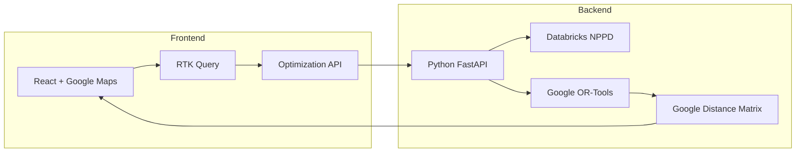

# Sales Route & Territory Optimizer (SRTO) 
# Frontend Technology Stack Decision Document

**Document Version:** 1.0  
**Date:** December 2024  
**Status:** Approved  
**Authors:** SRTO Technical Team

---

## Executive Summary

This document outlines the technology stack decisions for the SRTO frontend application. After careful evaluation of requirements, team expertise, and backend architecture constraints, we have selected a modern, Google-centric technology stack that prioritizes consistency, performance, and rapid development.

### Key Decisions:
- **Framework:** React with TypeScript
- **Mapping:** Google Maps Platform (exclusive)
- **State Management:** Redux Toolkit with RTK Query
- **UI Library:** Ant Design (antd)
- **Build Tool:** Vite

---

## 1. Core Framework: React with TypeScript

### Decision: React 18+ with TypeScript 5+

### Reasoning:

#### Why React:
1. **Component Architecture Alignment**
   - SRTO's UI naturally decomposes into reusable components (outlet cards, route lists, territory panels)
   - React's component model maps perfectly to our domain objects

2. **Ecosystem Maturity**
   - Extensive Google Maps React libraries (react-google-maps/api)
   - Rich selection of data visualization libraries
   - Strong community support for enterprise applications

3. **Performance Characteristics**
   - Virtual DOM efficiently handles frequent updates to outlet lists and route visualizations
   - Concurrent features in React 18 improve responsiveness with large datasets
   - Suspense boundaries for progressive loading of map data

4. **Team Considerations**
   - Larger talent pool for hiring
   - Extensive documentation and learning resources
   - Proven patterns for enterprise applications

#### Why TypeScript:
1. **Type Safety for Complex Domain**
   ```typescript
   interface Outlet {
     id: string;
     location: google.maps.LatLngLiteral;
     tier: 'Gold' | 'Silver' | 'Bronze';
     nppdScore: number;
     assignedRoute?: string;
   }
   
   interface OptimizedRoute {
     salesPersonId: string;
     waypoints: google.maps.DirectionsWaypoint[];
     totalDistance: number;
     totalTime: number;
     outlets: Outlet[];
   }
   ```

2. **Integration Benefits**
   - Google Maps TypeScript definitions are excellent
   - Type safety across frontend-backend boundary
   - Better IDE support for Google APIs

3. **Maintenance & Refactoring**
   - Confident refactoring as application grows
   - Self-documenting interfaces
   - Catch errors at compile time

---

## 2. Mapping Solution: Google Maps Platform

### Decision: Google Maps exclusively (no hybrid approach)

### Reasoning:

#### Backend Architecture Alignment:
1. **Google VRP Integration**
   - Backend uses Google OR-Tools and Fleet Routing API
   - Same coordinate system and distance calculations
   - No data transformation needed between optimization and visualization

2. **Consistent Data Sources**
   ```javascript
   // Backend optimization result
   const vrpSolution = {
     route: googleFleetRoutingAPI.optimizedRoute,
     polyline: googleFormat.encodedPolyline
   };
   
   // Frontend visualization - direct usage
   directionsRenderer.setDirections(vrpSolution);
   ```

3. **Team Expertise**
   - Existing experience with Google Maps
   - No learning curve for additional mapping library
   - Proven patterns can be reused

#### Technical Capabilities:
1. **Essential Features Available**
   - MarkerClusterer for handling 1000+ outlets
   - Drawing Manager for territory selection
   - Directions Service for route visualization
   - Distance Matrix for real-time calculations

2. **Data Quality**
   - Superior geocoding for emerging markets
   - Real-time traffic data
   - Business hours and POI information

#### Performance Optimization Strategy:
```typescript
// Hierarchical rendering based on zoom level
const renderStrategy = {
  zoomLevel < 10: renderTerritoriesOnly(),
  zoomLevel 10-14: renderClusteredOutlets(),
  zoomLevel > 14: renderIndividualOutlets()
};

// Viewport-based rendering
const visibleOutlets = outlets.filter(outlet => 
  map.getBounds().contains(outlet.location)
);
```

---

## 3. State Management: Redux Toolkit (RTK) + RTK Query

### Decision: Redux Toolkit with RTK Query for data fetching

### Reasoning:

#### Complex State Requirements:
1. **Multi-Domain State**
   ```typescript
   interface RootState {
     territories: TerritoriesState;
     outlets: OutletsState;
     routes: RoutesState;
     salespeople: SalespeopleState;
     optimization: OptimizationState;
     ui: UIState;
   }
   ```

2. **Cross-Feature State Dependencies**
   - Outlet assignments affect territory calculations
   - Route changes impact multiple salespeople
   - Manual adjustments trigger re-optimization

3. **RTK Query Benefits**
   - Automatic caching of Google API responses
   - Optimistic updates for manual adjustments
   - Background re-fetching of optimization results

#### Integration with Backend:
```typescript
const srtoApi = createApi({
  baseQuery: fetchBaseQuery({ 
    baseUrl: '/api',
    prepareHeaders: (headers) => {
      headers.set('X-Google-Maps-Session', sessionToken);
      return headers;
    }
  }),
  endpoints: (builder) => ({
    optimizeRoutes: builder.mutation<OptimizedRoutes, OptimizationRequest>({
      query: (params) => ({
        url: 'optimize',
        method: 'POST',
        body: params
      }),
      // Optimistically update UI while backend processes
      onQueryStarted: async (arg, { dispatch, queryFulfilled }) => {
        const patchResult = dispatch(
          routesSlice.actions.setOptimizing(true)
        );
        try {
          await queryFulfilled;
        } catch {
          patchResult.undo();
        }
      }
    })
  })
});
```

---

## 4. UI Component Library: Ant Design (antd)

### Decision: Ant Design 5.x

### Reasoning:

#### Enterprise Feature Set:
1. **Data-Heavy Components**
   - Advanced tables with sorting/filtering for outlet lists
   - Form components for complex configuration
   - Date/Time pickers for scheduling
   - Upload components for CSV/Excel import

2. **SRTO-Specific Needs**
   ```typescript
   // Territory assignment modal
   <Modal title="Assign Outlets to Territory">
     <Transfer
       dataSource={outlets}
       targetKeys={assignedOutletIds}
       render={outlet => outlet.name}
       showSearch
     />
   </Modal>
   
   // Route timeline
   <Timeline>
     {route.waypoints.map(waypoint => (
       <Timeline.Item>
         {waypoint.outlet.name} - {waypoint.estimatedArrival}
       </Timeline.Item>
     ))}
   </Timeline>
   ```

3. **Consistent Design Language**
   - Professional appearance out-of-the-box
   - Comprehensive theme customization
   - Responsive grid system

---

## 5. Build Tools & Development

### Decision: Vite + SWC

### Reasoning:

#### Development Speed:
1. **Fast HMR (Hot Module Replacement)**
   - Critical for map development iteration
   - Instant feedback on route adjustments
   - No full page reloads losing map state

2. **Optimized Production Builds**
   - Code splitting by route and feature
   - Tree shaking for Google Maps modules
   - Efficient chunking strategy

#### Configuration Example:
```typescript
// vite.config.ts
export default defineConfig({
  plugins: [react()],
  resolve: {
    alias: {
      '@': '/src',
      '@components': '/src/components',
      '@features': '/src/features'
    }
  },
  optimizeDeps: {
    include: ['@googlemaps/js-api-loader', 'antd']
  },
  build: {
    rollupOptions: {
      output: {
        manualChunks: {
          'google-maps': ['@googlemaps/js-api-loader'],
          'vendor-ui': ['antd', '@ant-design/icons'],
          'vendor-state': ['@reduxjs/toolkit', 'react-redux']
        }
      }
    }
  }
});
```

---

## 6. Additional Libraries

### Data Visualization
- **Recharts**: For dashboard analytics
- **Apache ECharts**: For complex territory performance visualizations

### File Handling
- **SheetJS**: Excel import/export for outlet data
- **PapaParse**: CSV parsing with streaming support
- **FileSaver.js**: Journey plan exports

### Utilities
- **React Hook Form**: Complex form validation
- **dayjs**: Date manipulation (smaller than date-fns)
- **lodash-es**: Utility functions (tree-shakeable)

### Development & Testing
- **Vitest**: Unit testing
- **React Testing Library**: Component testing
- **MSW**: API mocking for Google Maps services

---

## 7. Project Structure

```
src/
├── components/
│   ├── common/
│   │   ├── Map/
│   │   ├── DataTable/
│   │   └── LoadingStates/
│   ├── outlets/
│   │   ├── OutletList/
│   │   ├── OutletMap/
│   │   └── OutletFilters/
│   ├── routes/
│   │   ├── RouteOptimizer/
│   │   ├── RouteTimeline/
│   │   └── RouteMap/
│   └── territories/
│       ├── TerritoryBoundaries/
│       └── TerritoryAssignment/
├── features/
│   ├── optimization/
│   ├── reporting/
│   └── settings/
├── services/
│   ├── googleMaps/
│   ├── api/
│   └── export/
├── store/
│   ├── slices/
│   └── api/
├── hooks/
│   ├── useGoogleMaps/
│   ├── useOptimization/
│   └── useDataExport/
└── utils/
    ├── geoCalculations/
    └── formatters/
```

---

## 8. Integration Architecture

### Frontend-Backend Data Flow:



### Key Integration Points:

1. **Optimization Requests**
   ```typescript
   interface OptimizationRequest {
     territory: string;
     date: string;
     constraints: {
       maxRouteTime: number;
       maxOutletsPerRoute: number;
       includeNPPD: boolean;
     };
     manualAssignments?: {
       outletId: string;
       salesPersonId: string;
     }[];
   }
   ```

2. **Real-time Updates**
   - WebSocket connection for optimization progress
   - Server-Sent Events for NPPD score updates
   - Polling for long-running optimization jobs

---

## 9. Performance Considerations

### Optimization Strategies:

1. **Progressive Loading**
   ```typescript
   // Load territories first, then outlets on demand
   const TerritoryView = () => {
     const { data: territories } = useGetTerritoriesQuery();
     const [selectedTerritory, setSelectedTerritory] = useState(null);
     
     return (
       <>
         <TerritoryList territories={territories} />
         {selectedTerritory && (
           <Suspense fallback={<OutletLoadingState />}>
             <OutletMap territoryId={selectedTerritory} />
           </Suspense>
         )}
       </>
     );
   };
   ```

2. **Memoization**
   ```typescript
   const MemoizedOutletMarkers = React.memo(
     ({ outlets, map }) => outlets.map(outlet => 
       <Marker key={outlet.id} position={outlet.location} map={map} />
     ),
     (prevProps, nextProps) => 
       prevProps.outlets.length === nextProps.outlets.length
   );
   ```

3. **Web Workers for Heavy Calculations**
   ```typescript
   // Territory statistics calculation in web worker
   const calculateTerritoryStats = (outlets: Outlet[]) => {
     const worker = new Worker('/workers/territory-stats.js');
     worker.postMessage({ outlets });
     return new Promise(resolve => {
       worker.onmessage = (e) => resolve(e.data);
     });
   };
   ```

---

## 10. Cost Analysis

### Google Maps API Costs (Estimated):
- **Maps JavaScript API**: $7 per 1,000 loads
- **Geocoding API**: $5 per 1,000 requests
- **Distance Matrix API**: $5 per 1,000 elements
- **Directions API**: $5 per 1,000 requests

### Cost Optimization:
1. Session-based pricing for Maps JavaScript API
2. Aggressive caching of geocoding results
3. Batch distance matrix requests
4. Static maps for reports

### Estimated Monthly Cost:
- 100 users × 20 days × 10 sessions = 20,000 map loads = $140
- 1,000 new outlets × geocoding = $5
- Route optimizations: ~$50
- **Total: ~$200/month**

---

## 11. Risk Mitigation

### Identified Risks & Mitigations:

1. **Google Maps Performance with Large Datasets**
   - Mitigation: Implement clustering, viewport culling, and progressive loading
   - Fallback: Consider Mapbox for visualization layer only if needed

2. **API Cost Overruns**
   - Mitigation: Implement strict API quotas and monitoring
   - Fallback: Self-hosted tile server for base maps

3. **Complex State Management**
   - Mitigation: Comprehensive testing and state normalization
   - Fallback: Modularize state if it becomes unwieldy

---

## 12. Implementation Roadmap

### Phase 1: Foundation (Weeks 1-4)
- Setup React + TypeScript + Vite
- Integrate Google Maps with basic outlet display
- Implement Redux Toolkit structure
- Basic CRUD operations for outlets/territories

### Phase 2: Core Features (Weeks 5-8)
- Route optimization integration
- Manual territory adjustment tools
- Basic reporting dashboard
- Data import/export

### Phase 3: Advanced Features (Weeks 9-12)
- Real-time optimization updates
- Advanced analytics
- Performance optimizations
- Multi-day planning

### Phase 4: Polish & Scale (Weeks 13-16)
- Performance testing with large datasets
- UI/UX refinements
- Documentation
- Deployment optimizations

---

## Conclusion

This technology stack provides a solid foundation for SRTO that:
- Leverages team expertise with Google Maps
- Maintains consistency with backend architecture
- Provides excellent developer experience
- Scales to handle enterprise requirements
- Minimizes technical risk

The decisions prioritize practical delivery over theoretical optimizations, while maintaining flexibility for future enhancements.